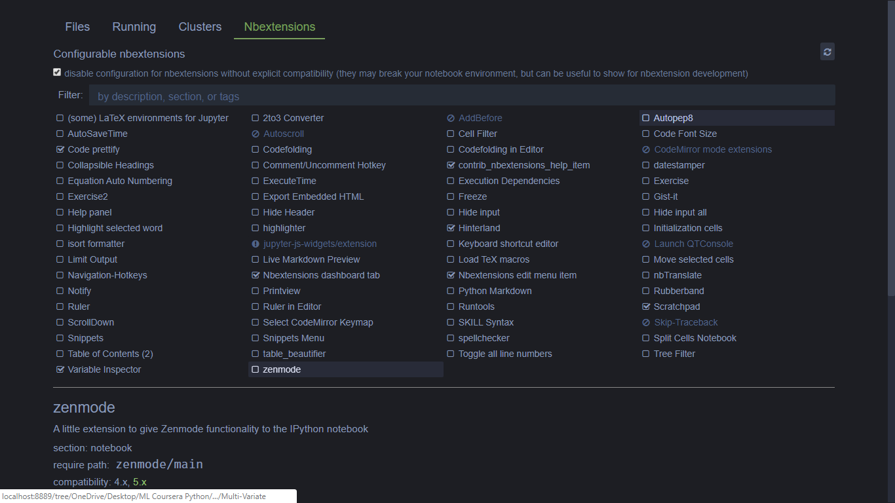

# Customize your jupyter notebook

## Adding custom theme

First we have to install jupyterthemes

### Install with pip

```bash
# install jupyterthemes
pip install jupyterthemes

# upgrade to latest version
pip install --upgrade jupyterthemes
```

for more info refer the [docs](https://github.com/dunovank/jupyter-themes)

### Applying theme

```bash
jt -t onedork -altp -tfs 11 -nfs 115 -cellw 88% -T -N -cursc p -f firacode -dfs 10 -fs 14 -ofs 11
```

refer [docs](https://github.com/dunovank/jupyter-themes#command-line-usage) for understanding each flag

also `I have modified css for tooltip and completions in` [custom.css](custom.css) copy and paste at `~/.jupyter/custom/custom.css`

### Adding styles for Plots

Include the following in `~/.ipython/profile_default/startup/startup.ipy` file to set plotting style automatically whenever you start a notebook

```python
# import jtplot module in notebook
from jupyterthemes import jtplot

# choose which theme to inherit plotting style from
# onedork | grade3 | oceans16 | chesterish | monokai | solarizedl | solarizedd
jtplot.style(theme='onedork')

# set "context" (paper, notebook, talk, poster)
# scale font-size of ticklabels, legend, etc.
# remove spines from x and y axes and make grid dashed
jtplot.style(context='talk', fscale=1.4, spines=False, gridlines='--')

# turn on X- and Y-axis tick marks (default=False)
# turn off the axis grid lines (default=True)
# and set the default figure size
jtplot.style(ticks=True, grid=False)

```

`Note: I had this problem of styles not getting applied for plots I solved it by installing jupyterthemes through Anaconda terminal`

## Adding Extensions

```bash
conda install -c conda-forge jupyter_contrib_nbextensions  jupyter_nbextensions_configurator
```

then

```bash
jupyter nbextensions_configurator enable --user
```

now restart/start Jupyter Notebook and you should be seeing a new tab to enable/disable extensions.

#### for example:

to enable autocompletion

```bash
jupyter nbextension enable hinterland/hinterland
```

and more extensions available to enhance your productivity look at the image below


